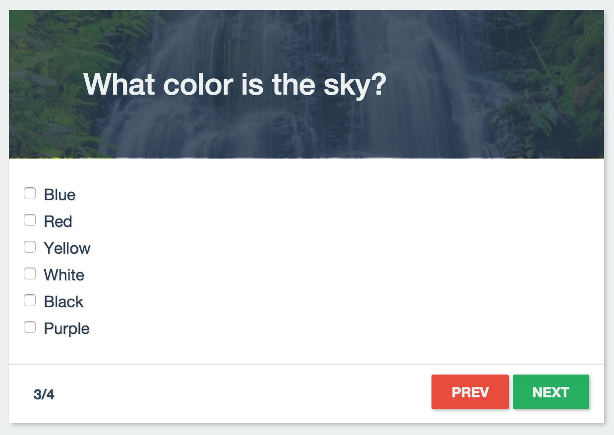

# Backbone + ES6 + Webpack

This is an example of a "Questions and answers" application using Backbone and Webpack written with ES6 syntax.



## Install and preview
- Run the following command inside of the repository folder: ```npm i && npm run serve```
- It should open a new browser window with the address ```http://localhost:3000/```

## Check the score
- Just type ```localStorage.score``` in the web browser console in order to check the current score.

## License
[DO WHAT THE FUCK YOU WANT TO PUBLIC LICENSE](http://www.wtfpl.net/txt/copying/)
